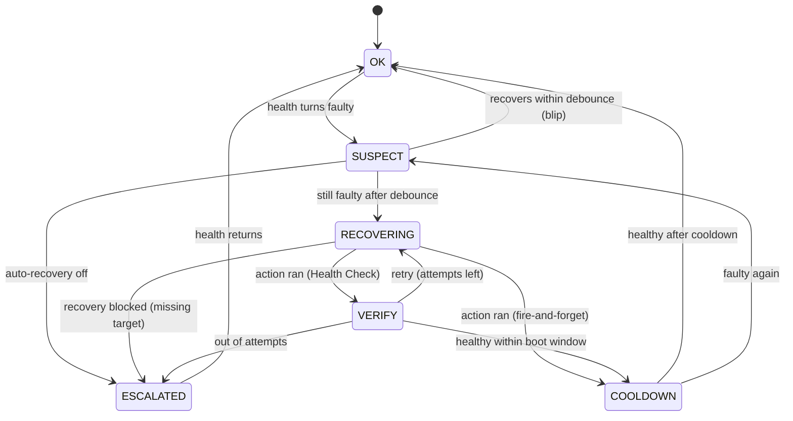

# Necromancer

[](https://github.com/MrTomRocker/homeassistant-necromancer/releases/)
[](#license)
[](https://github.com/MrTomRocker/homeassistant-necromancer/issues)
[](https://github.com/hacs/integration)
[](https://github.com/MrTomRocker/homeassistant-necromancer/releases)

<div align="center">
  
</div>

**Necromancer is a generic self-healing framework for Home Assistant.** It watches your
devices, decides — calmly — when one is actually broken, and runs a recovery: power-cycle a
switch, run an action, or auto-resolve a device to its PoE port and reboot it. It replaces the
usual pile of bespoke *"ping → reload/restart"* automations with one configurable engine,
vendor-agnostic, as an orchestrator on top of the entities you already have.

<table align="center">
  <tr>
    <td align="center" width="50%"><b>🔌 Auto-PoE — access point</b></td>
    <td align="center" width="50%"><b>🔁 Smart plug — pool pump</b></td>
  </tr>
  <tr>
    <td></td>
    <td></td>
  </tr>
  <tr>
    <td align="center"><sub>Ping spikes → the PoE port is power-cycled → recovery <b>verified</b>.</sub></td>
    <td align="center"><sub>Power draw collapses → the smart plug is power-cycled → recovery <b>verified</b>.</sub></td>
  </tr>
</table>

---

**Start here:** [Why Necromancer?](#why-necromancer) · [Features](#features) · [Installation](#installation) · [Getting started](#getting-started)
**Understand it:** [How it works](#how-it-works) · [Health Sources](#health-sources) · [Recovery strategies](#recovery-strategies) · [Timing & behaviour](#timing--behaviour) · [What you get](#what-you-get-per-guarded-device)
**Go deeper:** [Linked guards](#linked-guards-groups) · [Supervisor guards](#supervisor-guards-watch-other-guards) · [PoE ports](#poe-ports) · [Notifications](#notifications) · [Services](#services)
**Use & support:** [Cookbook](#cookbook) · [FAQ](#faq) · [Architecture](#architecture--internals) · [Contributing](#contributing) · [License](#license)

---

## Why Necromancer?

It started as a mess of my own making: my *"is this device dead? → fix it"* logic was spread
across **pyscript, Node-RED and a stack of Home Assistant automations** — every device handled a
little differently, and half of them never even checked whether the thing actually came back. I
wanted **one harmonized workflow** for every device and service instead of rebuilding
*"ping → restart"* by hand each time. So I built Necromancer.

Devices die quietly. A Hue bridge that needs a power-cycle, an access point that drops off the
network, a camera that hangs — each one usually ends up with its own hand-written
*"if unreachable for 5 minutes, toggle this switch and hope"* automation. They're brittle, they
never verify the device actually came back, and PoE-restart tooling is vendor-locked
(UniFi / Omada / Netgear) while generic SNMP tools are port-centric with no device logic.

Necromancer is vendor-agnostic. It watches **any** health signal you already have and runs
**any** recovery you can express — and for PoE it resolves a device to the **right port
automatically** (by MAC, hostname or neighbour, even after you move the cable), cycles it, and
**confirms the device is healthy again** before calling it done.

> *Examples:* a **Hue bridge** on a ping sensor → Necromancer finds its PoE port, cuts power, waits
> for it to come back, and only then clears the alarm. A wedged **Docker container** → a graceful
> restart, and a force-kill if that didn't take — both in one attempt. A **solar inverter** that's
> *"online but making 0 W at noon"* → caught by a template and alerted. One guard each, no brittle
> automation.

**What sets it apart:**

- **It verifies — it doesn't hope.** A recovery counts as done only once health reads OK *again*;
  an action that ran but didn't fix anything is a failed attempt, not a success. Ambiguous health
  (missing entity, render error, `unknown`/`unavailable`) is treated as *unknown* — never a fault,
  so nothing is power-cycled on a hunch.
- **Vendor-neutral PoE that finds the port for you.** No UniFi/Omada/Netgear lock-in: point it at
  any switch that reports its ports (or pin a static mapping) and it resolves device → port by
  MAC/IP/name — even after the device has dropped off the switch and aged out of the neighbour table.
- **One engine, and guards that cooperate.** Each device is a *guard* (health + recovery + timing)
  built in a wizard — not a pile of `if unreachable for 5 min` YAML. Link guards that share a root
  cause so one repairs and the rest follow, or stage cheap fixes under a **supervisor** guard.

Under the hood it's three pluggable layers, each with a generic escape hatch so the common case
needs no custom code:

> **HealthSource** *(is it ok?)* → **Engine** *(lifecycle + timing)* → **RecoveryDriver** *(fix it)*

## Features

**One harmonized workflow for every device and service.** A Hue bridge, a Docker container, a smart
plug, a PoE camera or a cloud bridge — all guarded with the *same* model (health → recovery → verify
→ timing), vendor- and protocol-agnostic. No bespoke per-device scripts.

🔎 **Detect — is it broken?**

- 🩺 **Two Health Sources** — any entity's state/attribute, or an inline **Jinja template** (e.g. *"online but drawing 0 W"*). Ambiguous readings (`unknown`/`unavailable`, render errors) count as *unknown*, never a fault.

🛠 **Recover — fix it**

- 🔌 **Power-cycle a switch** — a smart plug, relay or any `switch`/`input_boolean`: off → wait → on.
- ▶️ **Run any action** — a script, service call, SSH, `rest_command`, webhook, MQTT — anything Home Assistant can do.
- 🔁 **Off/on action pair** — cut power one way, restore it another, with variables carried from the *off* step into the *on* step (no helper entity needed).
- 🧪 **Rich Jinja context for your actions** — recovery actions receive `attempt` / `max` / `name` / `guard_entity_id`, and notify actions a full alert variable set — so deeply-integrated actions and automations can branch on the live recovery context.
- 🐳 **Restart containers, add-ons & services** — graceful first, then a harder fallback *inside the same attempt* (`if/then`, `wait_template`).
- 🔄 **Reload the device's integration after a repair** — an optional checkbox: Necromancer reloads the assigned device's config entry (before re-checking health), so Home Assistant reconnects to a device that just came back.
- 📡 **Vendor-neutral Auto-PoE** — resolves a device to its PoE port by MAC / IP / name and power-cycles it; no UniFi/Omada/Netgear lock-in, and it works even after the device aged out of the switch.
- 📤 **Bulk YAML import/export** — manage the PoE port list as YAML for bigger setups (export → edit → import, round-trip-safe).
- ✅ **Verify, don't hope** — a fix only counts once health reads OK *again*; otherwise it retries up to your limit, then escalates.

🤝 **Coordinate & alert**

- 🔗 **Guards cooperate** — link guards that share a root cause (one repairs, the rest follow), or stage cheap fixes under a **supervisor** guard that escalates to a heavier one.
- 🛎️ **Notifications are yours** — every problem / recovery / escalation runs an action *you* define (push, TTS, a script); a guard can even push its own progress messages mid-recovery via `necromancer.notify_guard`.

⚙️ **Operate & integrate**

- 🎛️ **Full operator surface** — per-guard status & health entities, a revive button, an arm/disarm switch, and recovery `event`s for dashboards and automations.
- 🤖 **Actions for your automations** — `necromancer.snooze` / `snooze_all` / `reset` / `repair_poe_port` / `notify_guard` / `check_health` / `wait_for_health`, callable from any automation or script (snooze everything before a mass reboot, cycle a PoE port on demand, or let a recovery script re-use a guard's Health Check).
- 😴 **Maintenance mode** — `snooze` one guard or `snooze_all` before planned work; they go quiet and auto-resume.
- 🧰 **Wizard-built & reconfigurable** — create and edit guards entirely in the UI; no YAML to hand-write.
- 🏠 **Local & dependency-free** — no cloud, no extra Python packages; it orchestrates the entities you already have, and its verdicts (escalated, snooze) survive a restart.
- 🌍 **Localized** — full English and German UI.

👉 **Real-world use cases:** see the **[Cookbook](#cookbook)** — PoE access points, Hue / Zigbee / Z-Wave bridges, Docker containers, pool pumps, solar inverters, Node-RED watchdogs and more.

## Installation

### HACS (Home Assistant Community Store)

Necromancer is **not in the HACS default store yet**, so add it as a custom repository.

<details open>
<summary>Add as a custom repository</summary>

1. Open **HACS** in Home Assistant.
2. Click the `⋮` menu in the top right and choose **Custom repositories**.
3. Add the URL `https://github.com/MrTomRocker/homeassistant-necromancer` and set the category to **Integration**.
4. Search for **Necromancer** in HACS and click **Download**.
5. Restart Home Assistant.
6. Add the integration via **Settings → Devices & Services**.

</details>

You can also use this shortcut once the repository is known to HACS:

[](https://my.home-assistant.io/redirect/hacs_repository/?owner=MrTomRocker&repository=homeassistant-necromancer&category=integration)

<details>
<summary>Manual installation</summary>

1. Copy the `custom_components/necromancer` directory from this repository into your Home
   Assistant `config/custom_components/` folder.
2. Restart Home Assistant.

</details>

**Requires** Home Assistant **2025.7** or newer.

## Getting started

You add Necromancer **once** (no input), then add a *guarded device* for each thing you want
watched.

1. Go to **Settings → Devices & Services**, click **+ Add Integration** and search for
   **Necromancer**. Confirm — it's added with no devices yet.
2. On the Necromancer entry, click **Add device** to create a guard. The wizard walks you through:
   **Health Source → device & check → what to do (notify-only or a recovery strategy) → its settings**.

<div align="center">
  
</div>

Along the way you set the **timing** (debounce / boot window / cooldown / max attempts — see
[Timing & behaviour](#timing--behaviour)), an optional **notify action** (see
[Notifications](#notifications)), an optional **restart-device-integration** toggle (when a device
is assigned), and optionally link the guard to others. The defaults are sensible; tune them per
device.

That's a complete guard. For the **Auto-PoE** strategy you also configure your switch's ports
once — see [PoE ports](#poe-ports). The rest of this README explains each piece in increasing
depth, and [Cookbook](#cookbook) shows ready-made guard/strategy pairings.

## How it works

Everything is built on one idea:

> **A guard pairs one health signal with one recovery and runs both through a fixed lifecycle.**

The Health Source — an entity's state or a Jinja template — is evaluated continuously, so the
*same* check that detects a fault also confirms the fix. The recovery is whatever you choose.
Around that, the engine runs a deliberately conservative lifecycle:

- **Detect → confirm.** A fault must persist for the *debounce* window before anything happens —
  transient blips are ignored.
- **Recover → verify.** After the recovery action, the guard waits up to the *boot window* for
  health to read OK again. A recovery counts as successful only when the device *actually* reports
  back — not when the action merely ran.
- **Settle.** A *cooldown* follows a success; repeated failures *escalate* after a few attempts
  instead of looping forever.



Two guarantees fall out of this design:

- **No false alarm.** Ambiguous health — a missing entity, a render error, `unknown`/`unavailable`
  — is treated as *unknown*, never as a fault. Nothing is ever cycled on a hunch.
- **No false success.** With the Health Check on, a recovery is only "done" once health verifies OK
  again; an action that ran but didn't fix anything is a failed attempt, not a success. With the
  Health Check **off** there's no device check, so the **driver's own result** decides: a PoE port
  that doesn't come back online, or an action that set `recover_failed`, counts as a failed attempt —
  not a blind success.

State that matters across a Home Assistant restart — the escalation verdict, attempt counters,
recovery stats and the per-guard auto-recovery switch — is **persisted** independently of the
display entities.

## Health Sources

How a guard decides whether a device is alive. Both are continuous, checkable expressions, so the
verify step always works:

| Source | What it is | Healthy when |
|---|---|---|
| **State-based** | one entity's state or attribute, compared to on/off value lists | the value is in the *on* list (e.g. a ping / reachability sensor reads `on`) |
| **Template-based** | an inline Jinja template returning `true`/`false` | the template renders `true`/`on`/`1`/`yes` (anything else — `false`/`off`/`0`/`no` is faulty, the rest is *unknown*) |

By default `unavailable`/`unknown` count as *unknown* (no false alarm). If "the entity is gone"
*is* the failure you want to act on, list `unavailable` in the **off** values — then it triggers
recovery like any other fault.

Both the **on** and **off** sides accept a *list* of values, so several states can count as healthy
(e.g. `home` **and** `on`) or as faulty — not just a single value.

## Recovery strategies

Pick the shape that fits the device:

| Strategy | What it does |
|---|---|
| **Power-cycle a switch** | turn a switch off → wait → on (e.g. a smart plug) |
| **Run an action** | one action sequence — script, service, SSH, webhook, … |
| **Off/on actions** | an *off* action → wait → an *on* action |
| **Auto-PoE** | resolve the device to its PoE port and power-cycle it, with a staged verify (the port goes offline → comes back) on top of the device Health Check (when its toggle is on). It **remembers** the port while the device is healthy, so it can still recover a device that has already dropped off the switch and aged out of the neighbour table |

> ⚠️ **A power-cycle can leave a device off.** If the *off* succeeds but the *on* can't run — the host
> or network is gone mid-cycle, e.g. you cut power to the very switch your network or Home Assistant
> runs on — the device stays off and the guard **escalates** (so you're alerted). Don't guard a
> device with a recovery that cuts its own lifeline.

Every recovery has a **Health Check** toggle (on by default). With it on, Necromancer waits until the
device reports healthy again before declaring success — the boot window and retries below apply. Turn
it off for **fire-and-forget**: the action runs once and success is assumed (continuous monitoring
re-triggers if it didn't take). The toggle and its two numbers sit in the *Behaviour* section.

A **notify-only** guard skips recovery entirely — it just detects the problem and raises the event
(and optionally notifies). Pick **Notify only** at the top of the strategy step to be told about
something you'd rather fix by hand.

**Variables in your actions.** The *Run an action* and *Off/on actions* strategies hand your action
the guard's run context as Jinja variables — `attempt` and `max` (the current try and the limit),
plus `name` and `guard_entity_id` (the guard's own status sensor) — so an action can branch on the
attempt (a gentle fix first, a harder one on the second try), or report its own progress on the
guard's notify channel via `necromancer.notify_guard` (`target: {entity_id: "{{ guard_entity_id }}"}`).
With **Off/on actions**, any variables you set in the off action (a
`variables:` step) are also readable in the on action, so you can capture state before cutting power
and restore it afterwards — no helper entity needed. A variable you set only *conditionally* (inside
an `if`/`choose` that may not run) is `undefined` when that branch is skipped — read it with
`| default(...)` in the on action.

**Report a failed repair.** Set `recover_failed: true` (a `variables:` step) in your recovery
action to tell the guard the repair did **not** work. Without a Health Check this turns the attempt
into a failure (retry, then escalate) instead of a blind success; with one, the device check still
decides — either way the verdict shows in `last_recover_driver_result`. Leave it unset for a normal
(good) outcome.

**Restart device integration (optional).** When the guard has a device assigned, the recovery step
shows a *Restart device integration* toggle: after the repair action — and before re-checking
health — Necromancer reloads that device's integration (its config entry), after a delay you set.
Handy when Home Assistant has to reconnect to a device that just came back (e.g. a bridge after a
power-cycle), so you don't have to script a `homeassistant.reload_config_entry` action yourself.

## Timing & behaviour

Four knobs shape *when* a guard acts. The defaults are sensible; tune them per device. They live in
the collapsed *Behaviour* section of the wizard.

| Setting | Default | What it controls |
|---|---|---|
| **Debounce** | 120 s | How long a fault must persist before recovery starts. Absorbs short blips. |
| **Boot window** | 180 s | How long to wait for the device to report healthy again after the recovery action, before counting the attempt as failed. Set it to the slowest your device takes to come back. |
| **Cooldown** | 600 s | The pause after a *successful* recovery before the guard returns to `ok`. Prevents tight loops; if the device is still (or again) faulty when the cooldown elapses, the guard re-enters `suspect` (debounce) rather than looping straight back into recovery. |
| **Max attempts** | 2 | How many times to retry before escalating. (Applies when the Health Check is on; with it off the action runs once, fire-and-forget.) |

A few consequences worth knowing:

- Retries are **back-to-back** — only the recovery action's own runtime separates them. The
  "pause after an attempt" is the cooldown, which happens *after success*, not between retries.
- **Escalation** (`escalated`) is the dead end: the guard has given up (or recovery was blocked, or
  auto-recovery is off). It clears itself back to `ok` automatically the moment health returns.
- **Auto-recovery off** (the per-guard switch) means *off*: the guard still detects and escalates,
  but never touches anything — not its own recovery, and not following a linked partner (see below).
- The **manual recover button** forces a cycle right now, bypassing both the debounce and the
  auto-recovery switch. An active `snooze` is lifted too — an explicit press overrides it.

## What you get per guarded device

Pure-view entities (on their own device, or attached to the device you assign the guard to) —
recover guards get all five, notify-only guards just the status sensor + health:

| Entity | Purpose |
|---|---|
| `sensor.<guard>_status` | The lifecycle state: `ok` / `suspect` / `recovering` / `verify` / `cooldown` / `escalated` / `snoozed`. Attributes include `recover_count` / `fail_count`, `last_recover` / `last_fail`, the `recover_driver` and its last verdict, and `snooze_until`. |
| `binary_sensor.<guard>_health` | The raw health verdict from the HealthSource. |
| `switch.<guard>_auto_recovery` | Arm/disarm automatic recovery for this guard (a configuration entity). |
| `button.<guard>_revive` | Trigger a recovery cycle manually. |
| `event.<guard>_recovery` | Fires on each recovery outcome — `recovered` / `escalated` / `blocked` — for dashboards, automations and history. |

<div align="center">
  
</div>

**Misconfigured? Check Repairs.** A guard or PoE port that can't do its job because of a *config*
problem is surfaced in **Settings → Repairs** with the specific guard/port and how to fix it: a
health entity that's missing or disabled (a *blind* guard), a health template that reads only gone
entities, a recovery that references a missing service, or a PoE port with no device id or a missing
actuator. Each clears itself once you correct the config (saving reloads the guard). Repairs flag
config you can fix — a device that's simply *unreachable* isn't flagged here; the guard escalates
for that.

### The status sensor — states & attributes

`sensor.<guard>_status` is an enum sensor; its state is where the guard sits in the
lifecycle:

| State | Meaning |
|---|---|
| `ok` | Healthy, watching. |
| `suspect` | Unhealthy — waiting out the **debounce** before acting (filters blips). |
| `recovering` | A recovery cycle is running (the driver is acting). |
| `verify` | Recovery done — waiting (up to the **boot window**) for health to come back. |
| `cooldown` | Recovered — a short pause before re-arming. |
| `escalated` | Gave up, or the recovery was blocked — your alarm. |
| `snoozed` | Operator-suspended (`necromancer.snooze`) — health ignored, no alerts. |

Attributes: `attempt` (retries in the current cycle), `recover_count` / `fail_count`
(lifetime successes / failures), `last_recover` / `last_fail` (timestamps),
`recover_driver` (what gets cycled — the switch / port / actions),
`last_recover_driver_result` / `last_recover_driver_time` (the recovery driver's own
last verdict — `good` / `failed` — and when, distinct from the overall state above),
`snooze_until` (when a snooze auto-resumes).

### Recovery events — `event.<guard>_recovery`

Fires once per recovery outcome. The event data depends on the type — `recovered` carries
`via_link` / `recover_count`, while `escalated` and `blocked` carry `attempt` / `reason`:

| Event type | When |
|---|---|
| `recovered` | A recovery cycle brought the device back. |
| `escalated` | Ran out of attempts **or the recovery action errored** — the device didn't come back. A **device** problem. |
| `blocked` | Couldn't even *attempt* — the recovery target is missing/unresolvable (switch gone, no PoE-port match, no action). A **config/wiring** problem. |

`escalated` and `blocked` both leave the guard in the `escalated` **state**, so the event
is the only place that distinction surfaces — handy to alert differently ("fix the config"
vs "the device is dead").

### The other entities

- `binary_sensor.<guard>_health` — the raw HealthSource verdict (`on` = healthy).
  `unavailable` when the verdict is UNKNOWN (an `unavailable`/`unknown` source is never a
  fault — no false alarm).
- `switch.<guard>_auto_recovery` — arm/disarm automatic recovery (a configuration entity).
  **Off ≠ snooze:** with auto off the guard still *detects and escalates* (alarms) but
  won't act; `snooze` goes fully quiet.
- `button.<guard>_revive` — force a recovery cycle right now, bypassing the debounce and
  the auto-off gate, and lifting an active `snooze`.

### On your dashboard & in automations

The five entities are plain Home Assistant entities — no custom card needed:

- **Overview:** an `entities` (or `auto-entities`) card over every `sensor.*_status`. It's a proper
  enum sensor, so each state shows its localized label.
- **Per guard:** a tile with the status sensor plus the `revive` button and `auto_recovery` switch.
- **History:** drop `event.<guard>_recovery` into a logbook card to see `recovered` / `escalated` /
  `blocked` over time.

Automate on the recovery event — e.g. alert only when a guard actually gives up:

```yaml
- triggers:
    - trigger: state
      entity_id: event.hue_bridge_recovery
  conditions:
    - condition: template
      value_template: "{{ trigger.to_state.attributes.event_type in ['escalated', 'blocked'] }}"
  actions:
    - action: notify.mobile_app_phone
      data:
        message: "Necromancer gave up on {{ trigger.to_state.name }}"
```

## Linked guards (groups)

Several guards often share one root cause. A Hue **bridge** behind a PoE port might be watched by
both a *ping* guard and a *lamps-unavailable* guard; when the bridge dies, **both** detect it. Left
alone they'd both power-cycle the same port. Link them into a **group** instead (the collapsed
*Linked guards* section on any recover guard):

- When any member starts a recovery, the others **follow**: they pause their own logic, wait for the
  repair to finish, then re-check their own health. Whoever trips first leads — even on a
  simultaneous trip, exactly one leads and the rest follow (no double power-cycle).
- A follower that's **healthy** afterwards settles into the same cooldown as the leader. One that's
  **still unhealthy** decides by the leader's result: if the leader *succeeded*, only that
  follower's own device is still down, so it runs its own recovery; if the leader *failed*, the
  shared cause is unfixed, so the follower escalates too instead of piling on.
- **Follower notifications.** A follower that recovers *by following the group* is **silent on
  success** by default — one root-cause repair should send one success notification (the leader's),
  not a burst of identical ones. Tick *Report success even when this guard follows a group repair*
  in the *Linked guards* section if you want per-device confirmation. A follower that **fails** to
  recover always notifies (`linked_repair_failed`).
- A follower with **auto-recovery off** doesn't follow — if its device is affected it escalates,
  same as any auto-off guard. Off stays off.

Linking is **mutual and transitive**: link A to B, and if B already links to C the whole
`{A, B, C}` becomes one group, shown in full on the next edit. To leave a group, clear *all* of its
partners (a single remaining link re-forms the group). Every repair is also published as a
`necromancer_guard_repair` bus event — `{guard, name, phase}` (`start` / `done`), plus a `success`
flag on the `done` event — so your own automations can react to it.

## Supervisor guards (watch other guards)

A guard's **template** health can reference **other guards'** own entities — their
`sensor.<name>_status` (`ok` / `suspect` / `recovering` / `verify` / `cooldown` / `escalated` / `snoozed`) or
`binary_sensor.<name>_health`. That lets you **stage** recovery: small per-device guards try the
cheap fix first; a higher-level **supervisor guard** watches their status and triggers a bigger
recovery once several have given up.

```jinja
{# Supervisor: healthy UNLESS both bridge guards have escalated → then do the heavy fix #}
{{ not (is_state('sensor.hue_eg_ping_status', 'escalated')
        and is_state('sensor.hue_eg_lampen_status', 'escalated')) }}
```

Pair that template-health guard with a heavier strategy (e.g. Auto-PoE / a full power-cycle), and
give it a longer **debounce** so the sub-guards finish their own attempts first. The health picker
offers other guards' entities; only the guard's **own** entities are excluded (a self-reference
would loop — that case is warned about).

## PoE ports

The **Auto-PoE** strategy (and the `necromancer.repair_poe_port` service) need to know your
switch's ports. They're managed as a flat list under Necromancer's **Configure** (options). Each
port carries a status entity (is the port up?), the actuator switch that powers it, its own timing —
and an **id** that lets a guard find *which* port belongs to its device.

Every port also fires a `necromancer_poe_port` bus event on each status change — `{port, status}`
with status `good` / `recovering` / `failed` — handy to drive a per-port indicator or to alert when
a cycle fails.

### Identifying the right port — static vs. dynamic

A PoE guard has a **Device id (e.g. MAC, IP or name)** field; Necromancer power-cycles the one port
whose id matches it. A port reports its id **one way** — from an entity *or* a static label, never
both (setting both is rejected). You wire this up in one of two ways, depending on whether your switch
can report what's plugged into each port.

#### Static / statically assigned ports

Use this when the switch *can't* tell you what's connected — an unmanaged switch, or one with no
LLDP/neighbour data (e.g. a TP-Link SG108E). You pin the mapping by hand:

- On the **port**, leave *"Entity reporting the id"* empty and put a value in *"Static label"* —
  e.g. `hue-bridge`.
- On the **PoE guard**, set **Device id** to the same value: `hue-bridge`.

The match never changes — but it is *physical*: if you re-patch the device to another port, update the
static label yourself.

#### Dynamic / auto-discovery

Use this when the switch reports each port's neighbour (MAC, IP or hostname via LLDP/FDB/SNMP — e.g. a
managed switch surfaced through Node-RED). Necromancer resolves the port at runtime, so moving a device
between ports just works:

- On the **port**, set *"Entity reporting the id"* to that port's neighbour sensor (e.g.
  `sensor.poe_switch_port_1_neighbours`) and *"Attribute of that entity"* to the field that carries the
  id (e.g. `mac` or `ip`; leave empty to use the entity's state).
- On the **PoE guard**, set **Device id** to your device's value — for example:
  - by **MAC**: `b0:1f:81:b0:f4:84`
  - by **IP**: `192.168.1.42`

Necromancer scans every port, finds the one currently reporting that MAC/IP, cycles it, and waits for
the device to report healthy again. Re-patch the device to a different port and it still finds it. It
also **remembers** the last-known port while the device is healthy, so it can still recover a device
that has gone fully dark and aged out of the switch's neighbour table — as long as that port still
reports nothing connected. If a *different* device has since been patched onto the last-known port,
Necromancer drops the stale entry and refuses rather than power-cycling the wrong device.

> Ids are matched trimmed and case-insensitive (`B0:1F:81:…` matches `b0:1f:81:…`). **Exactly one** port
> must match: zero or several blocks recovery (it's logged and the guard goes to `escalated`), so
> nothing random ever gets power-cycled.

### Import / export the port list (YAML)

Clicking through the per-port form gets old fast once you have a switch full of ports. Under
Necromancer's **Configure** you can also **Export** and **Import** the whole list as YAML:

- **Export** — pick which ports (all are pre-selected) and copy the YAML. It's also a handy backup or
  something to keep in version control.
- **Import** — paste a list and choose **Merge** (add new ports, update existing ones with the same
  name) or **Replace** (overwrite the whole list). Every port is validated first; on any error nothing
  is changed and the reason is shown.

```yaml
- label: Switch klein Port 5
  actuator: switch.poe_switch_klein_port_5_poe
  id_entity: sensor.poe_switch_klein_port_5_neighbours
  id_attribute: mac
  status_entity: binary_sensor.poe_switch_klein_port_5_up
  status_on: ['on']
  status_off: ['off']
  off_on_delay: 5
  off_timeout: 40
  on_timeout: 90
```

Only `label`, `actuator` and `status_entity` are required; identity (`id_entity`/`id_attribute` or
`id_static`) and timings are optional and fall back to the defaults (timings must be ≥ 0). Quote any
value YAML might misread — booleans (`on`/`off`/`yes`/`no`/`true`/`false`) and all-digit or
digit-and-colon ids — as in `'on'` or `'00:11:22'`. Export already quotes those for you, so an
export → edit → import round-trip is always safe; on error the import is rejected with the reason and
nothing changes.

## Notifications

Each guard can optionally run a **notify action** on problem / recovery / escalation. There are no
fixed targets — you provide an action and Necromancer hands it the resolved, localized text as
variables, so you decide whether and how to be notified:

| Variable | What it is |
|---|---|
| `{{ message }}` | the full ready-made line — `"<name>: <event_text>"` (e.g. *"Hue Bridge: Recovery succeeded."*) |
| `{{ name }}` | the guard name (e.g. *"Hue Bridge"*) |
| `{{ event_text }}` | just the event text, **without** the name (e.g. *"Recovery succeeded."*) |
| `{{ event }}` | the event key (`recovery_attempt`, `recovery_success`, `recovery_failed`, `recovery_blocked`, `no_auto_recovery`, `problem_detected`, `linked_repair_failed`) |
| `{{ attempt }}` / `{{ max }}` / `{{ attempts }}` | recovery attempt count, max, and the plural-correct phrase (e.g. *"3 attempts"*) — where applicable |
| `{{ reason }}` | why recovery was **blocked** or **failed** (e.g. a missing PoE port) — set for `recovery_blocked` / `recovery_failed`, empty otherwise |

Variables that don't apply to an event arrive as an **empty string** (never undefined), so a
template can reference `{{ attempt }}` directly without a `| default` guard.

Take the ready-made `message`, or compose your own from the parts (handy for **TTS** and to avoid
repeating the name when you also set a title). The texts are phrased to read naturally aloud
(*"Recovery attempt 1 of 2."*, not *"1/2"*):

```yaml
# Simplest — the whole line:
- action: notify.mobile_app_phone
  data:
    message: "{{ message }}"        # "Hue Bridge: Recovery succeeded."

# Or build your own (e.g. title = name, body = event_text — no duplication):
- action: notify.mobile_app_phone
  data:
    title: "{{ name }}"             # "Hue Bridge"
    message: "{{ event_text }}"     # "Recovery succeeded."

# TTS:
- action: tts.speak
  data:
    message: "{{ name }}: {{ event_text }}"
```

The action runs **detached**, so a deliberate delay in your notify flow never stalls the engine.

## Services

Per-guard actions are exposed as services — target a guard's `sensor.<guard>_status`, its
device, or a whole area (bulk). Recovering *now* and arming auto-recovery stay the per-guard
**button** (`button.<guard>_revive`) and **switch** (`switch.<guard>_auto_recovery`) above.

```yaml
# Snooze one guard for 30 minutes (a device or area target expands to its status sensor):
- action: necromancer.snooze
  target:
    entity_id: sensor.hue_bridge_status
  data:
    duration: "00:30:00"
```

| Service | What it does |
|---|---|
| `necromancer.reset` | Clear an **escalated** guard back to normal and re-check it — a manual "try again" once you've fixed the root cause (or just to acknowledge the alarm). Still unhealthy → it recovers again; already healthy → it just resumes watching, no needless repair. |
| `necromancer.snooze` | Suspend a guard for a `duration` — it **ignores health and raises no alerts** (planned maintenance), shows `snoozed`, then **auto-resumes** when the time elapses (the remaining time survives a restart). Unlike turning auto-recovery *off* (which still detects and alarms), snooze goes fully quiet. Refused while a recovery is in flight. |
| `necromancer.unsnooze` | Resume a snoozed guard immediately instead of waiting for the timer. |
| `necromancer.notify_guard` | Send a **custom message through a guard's own notify action** — target a guard (its status sensor / device) and pass `message` (plus optional `event_text`, `event`, `attempt`, `max`). The notify action receives the **same variables a built-in alert does**, so your existing template works unchanged. For recovery scripts reporting their own progress on the channel the guard already uses; from a recovery action use `target: {entity_id: "{{ guard_entity_id }}"}`. |
| `necromancer.snooze_all` | **Maintenance mode for everything** — snooze *every* guard for a `duration` (no target needed), then they all auto-resume. Guards mid-recovery are skipped (best-effort, logged). Handy as a one-tap dashboard button before a disruptive change. |
| `necromancer.unsnooze_all` | Resume every snoozed guard at once. |
| `necromancer.repair_poe_port` | Resolve a device `id` (MAC / IP / static label) to its PoE port and power-cycle it. It blocks until done and **coalesces per port** — concurrent callers join the one in-flight cycle instead of each cycling the port. This is the exact primitive Auto-PoE uses — call it from your own actions or automations when you want "reboot whatever is on this device's port". |
| `necromancer.check_health` | **Evaluate a guard's health right now** and get it back (`{health: ok / unhealthy / unknown}`). Pass the guard's status entity as `guard` — typically `{{ guard_entity_id }}` inside a recovery action — and read `response_variable`. For a recovery script that wants to branch on the guard's *own* Health Check instead of rebuilding it. |
| `necromancer.wait_for_health` | **Wait until a guard reads healthy again** (or a `timeout`, default = the guard's boot window), returning `{health, timed_out, waited_s}`. Lets a *staged* recovery verify between tiers with the guard's definition of healthy: gentle fix → `wait_for_health` → `if timed_out`, escalate to the hard fix. `check_first` (default on) returns at once if it's already healthy. See [Staged recovery, verified by the guard itself](docs/cookbook/verified-staged-recovery.md). |

## Cookbook

Real guards from a live deployment — each a step-by-step recipe under [`docs/cookbook/`](docs/cookbook/). What it does, which Necromancer concepts it shows, and what to use it for:

| How-to | What it does | Concepts shown | Use it for |
|---|---|---|---|
| [Reboot a PoE access point](docs/cookbook/poe-access-point.md) | Cut PoE on the port to reboot the AP — gated so it never fires mid-flash or fleet-wide | Auto-PoE · firmware-update gate · controller-down gate | PoE APs, cameras, IP phones |
| [Recover a bridge two ways at once](docs/cookbook/bridge-belt-and-braces.md) | Two detectors (ping + "are the lights there?") share one port reboot + integration reload | linked guards · count health · `repair_poe_port` + reload | Hue / Zigbee / Z-Wave bridges & hubs |
| [Catch a device that's online but idle](docs/cookbook/inverter-sun-check.md) | Alert when a device is reachable but producing nothing — "is it doing its job?" | semantic health · notify-only | inverters, pumps, heat pumps |
| [Restart a stalled chlorinator](docs/cookbook/chlorinator-restart.md) | Same semantic health, but with an automatic power-cycle + verify | semantic health · power-cycle + verify · smoothed input | chlorinators, pool pumps, heaters |
| [Restart a pump, restore its interlocked device](docs/cookbook/pool-pump-restart.md) | Power-cycle a stalled pump and put the chlorinator back — carrying state across the off→on cycle | off/on actions · off→on variable carry · conditional restore · semantic health | pumps & devices behind a safety interlock |
| [Alert when a Node-RED flow stalls](docs/cookbook/nodered-heartbeat.md) | Watch data freshness (`last_reported`); notify, or auto-redeploy with a Health Check | freshness watchdog (`last_reported`) · notify or auto-redeploy | Node-RED flows, scrape / MQTT feeds |
| [Escalating recovery](docs/cookbook/escalating-recovery.md) | Graceful restart first, then a sledgehammer (kill-button / add-on restart) if it didn't take | `if/then` escalation · soft→hard restart · Health Check | containers, add-ons, services |
| [Staged recovery, verified by the guard itself](docs/cookbook/verified-staged-recovery.md) | Gentle fix → ask the guard "healthy yet?" → escalate only if not, re-using the guard's own Health Check | `check_health` / `wait_for_health` · staged `if/then` · one script for many guards | bridges/hubs + the devices behind them |
| [Recover by poking another system](docs/cookbook/recover-via-another-system.md) | Restart via MQTT / REST / SSH / webhook when HA can't do it directly, verified by health | `action_call` · MQTT / REST / SSH · Health Check | devices HA can't restart directly |
| [One notification script for every guard](docs/cookbook/notification-fanout.md) | Centralize routing once — time-aware, multi-channel — instead of per-guard config | central notify fanout · time-aware routing | any multi-guard setup |

## FAQ

**Why didn't my guard react when the device went offline?**
Either the Health Source read *unknown* rather than *faulty* (commonly: the entity went
`unavailable` and you didn't list `unavailable` as an off-value), or the outage was shorter than the
debounce window. Necromancer acts only on a confirmed, sustained fault.

**Why is the status still `recovering`/`verify` long after the action ran?**
With a Health Check, the guard waits up to the boot window for the device to report healthy again.
A device that boots slowly (a bridge can take minutes before its API and entities return) keeps the
guard in `verify` until it's genuinely back — that's the "no false success" guarantee at work.
Raise the boot window if your device needs longer.

**Why did it stop after two tries and go `escalated`?**
That's max attempts. The guard alerts you (if you set a notify action) rather than power-cycling
forever. It clears back to `ok` on its own once health returns.

**Why are both my linked guards showing `recovering` when only one is doing anything?**
By design. Linked guards share a root cause, so when one repairs the others hold and re-verify
afterwards, instead of running the same recovery in parallel.

**I turned off a guard's auto-recovery — why is it `escalated`?**
"Auto-recovery off" means the guard still watches and *alerts*, but won't act. A sustained fault
therefore goes straight to `escalated` (your alarm) rather than being fixed silently — including
when a linked partner is repairing the shared cause.

**Auto-PoE says it can't find the port.** Exactly one port must match the guard's device id. Zero
matches (the device is gone *and* there's no learned/last-known port) or several matches both block
recovery on purpose — nothing random gets power-cycled. Check that one port reports that MAC/IP, or
pin it with a static label (see *Identifying the right port* above).

**Disabling the device's entities to test it doesn't trigger anything.** A *disabled* entity reads
`unknown`, not `unavailable`, so a template checking `unavailable` won't fire. Simulate a real
outage instead (cut power, unplug), or override the state — don't disable the entity.

**Where's the option to link guards?** The *Linked guards* section only appears once there's
another recover guard to link to — so your very first guard has nothing to offer there. Add the
second guard, then link them from either guard's **Reconfigure**.

**When should I leave the Health Check on?** Keep it on (the default) whenever the recovery can fail
*silently* — for example Auto-PoE/`repair_poe_port` with an id that might not resolve, or an action
whose effect you can't otherwise confirm. With the Health Check on, the guard only declares success
once the device reports healthy again. Turn it off (fire-and-forget) only when the action is
inherently reliable: success is then assumed, and continuous monitoring re-triggers if it didn't
take — which can mean one premature "recovered" notification.

**What happens if Home Assistant restarts mid-recovery?** The in-flight cycle is dropped — on startup
the guard re-evaluates from live health and takes it from there. Only the lasting verdicts survive a
restart: an `escalated` alarm and an active `snooze` (with its remaining time), plus the recovery
stats (`recover_count`, `last_recover`) and the per-guard auto-recovery switch.

## Architecture & internals

This README is the user's guide. For the design — the full state machine, the health/driver/strategy
matrix, the PoE fabric and the guard-linking internals — see
[`docs/arch/architecture.md`](./docs/arch/architecture.md). Every timer and every behavioural case
(with its timing) is catalogued in [`docs/arch/timing.md`](./docs/arch/timing.md), and the test
concept lives in [`docs/arch/testing.md`](./docs/arch/testing.md).

## Contributing

Contributions are welcome — see [CONTRIBUTING.md](./CONTRIBUTING.md). In short: fork, lint &
format with `ruff`, run the P0 regression block, and open a focused pull request.

## License

Released under the [MIT License](./LICENSE).
