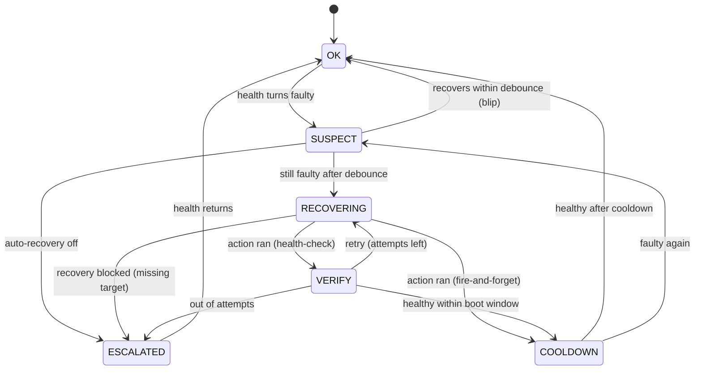

# Necromancer

[](https://github.com/MrTomRocker/homeassistant-necromancer/releases/)
[](#license)
[](https://github.com/MrTomRocker/homeassistant-necromancer/issues)

[](https://github.com/MrTomRocker/homeassistant-necromancer/releases)

<div align="center">
  
</div>

**Necromancer is a generic self-healing framework for Home Assistant.** It watches your
devices, decides — calmly — when one is actually broken, and runs a recovery: power-cycle a
switch, run an action, or auto-resolve a device to its PoE port and reboot it. It replaces the
usual pile of bespoke *"ping → reload/restart"* automations with one configurable engine,
vendor-agnostic, as an orchestrator on top of the entities you already have.

## How it works

Everything is built on one idea:

> **A guard pairs one health signal with one recovery and runs both through a fixed lifecycle.**

The health source — an entity's state or a Jinja template — is evaluated continuously, so the
*same* check that detects a fault also confirms the fix. The recovery is whatever you choose.
Around that, the engine runs a deliberately conservative lifecycle:

- **Detect → confirm.** A fault must persist for the *debounce* window before anything happens —
  transient blips are ignored.
- **Recover → verify.** After the recovery action, the guard waits up to the *boot window* for
  health to read OK again. A recovery counts as successful only when the device *actually* reports
  back — not when the action merely ran.
- **Settle.** A *cooldown* follows a success; repeated failures *escalate* after a few attempts
  instead of looping forever.



Two guarantees fall out of this design:

- **No false alarm.** Ambiguous health — a missing entity, a render error, `unknown`/`unavailable`
  — is treated as *unknown*, never as a fault. Nothing is ever cycled on a hunch.
- **No false success.** A `*_check` recovery is only "done" once health verifies OK again; an
  action that ran but didn't fix anything is a failed attempt, not a success.

State that matters across a Home Assistant restart — the escalation verdict, attempt counters,
recovery stats and the per-guard auto-recovery switch — is **persisted** independently of the
display entities.

## Why Necromancer?

Devices die quietly. A Hue bridge that needs a power-cycle, an access point that drops off the
network, a camera that hangs — each one usually ends up with its own hand-written
*"if unreachable for 5 minutes, toggle this switch and hope"* automation. They're brittle, they
never verify the device actually came back, and PoE-restart tooling is vendor-locked
(UniFi / Omada / Netgear) while generic SNMP tools are port-centric with no device logic.

Necromancer is vendor-agnostic. It watches **any** health signal you already have and runs
**any** recovery you can express — and for PoE it resolves a device to the **right port
automatically** (by MAC, hostname or neighbour, even after you move the cable), cycles it, and
**confirms the device is healthy again** before calling it done.

> *Example:* a Hue bridge guarded by a ping sensor. It goes unreachable → Necromancer finds the
> PoE port it's plugged into, cuts power, waits for the port and the bridge to come back, and
> only then clears the alarm. One guard replaces the whole brittle automation.

Under the hood it's three pluggable layers, each with a generic escape hatch so the common case
needs no custom code:

> **HealthSource** *(is it ok?)* → **Engine** *(lifecycle + timing)* → **RecoveryDriver** *(fix it)*

## What you get per guarded device

Four pure-view entities (on their own device, or attached to an existing device via the
Battery-Notes link pattern):

| Entity | Purpose |
|---|---|
| `sensor.<guard>_status` | The lifecycle state: `ok` / `suspect` / `recovering` / `verify` / `cooldown` / `escalated`. |
| `binary_sensor.<guard>_health` | The raw health verdict from the HealthSource. |
| `switch.<guard>_auto_recovery` | Arm/disarm automatic recovery for this guard. |
| `button.<guard>_revive` | Trigger a recovery cycle manually. |

<div align="center">
  
</div>

## Health sources

How a guard decides whether a device is alive. Both are continuous, checkable expressions, so the
verify step always works:

| Source | What it is | Healthy when |
|---|---|---|
| **State-based** | one entity's state or attribute, compared to on/off value lists | the value is in the *on* list (e.g. a ping / reachability sensor reads `on`) |
| **Template-based** | an inline Jinja template returning `true`/`false` | the template renders truthy |

By default `unavailable`/`unknown` count as *unknown* (no false alarm). If "the entity is gone"
*is* the failure you want to act on, list `unavailable` in the **off** values — then it triggers
recovery like any other fault.

## Recovery strategies

Pick the shape that fits the device. The first three come **plain** (fire-and-forget) or **with a
health-check** (wait until the device reports healthy again before declaring success):

| Strategy | What it does |
|---|---|
| **Power-cycle a switch** | turn a switch off → wait → on (e.g. a smart plug) |
| **Run an action** | one action sequence — script, service, SSH, webhook, … |
| **Off/on actions** | an *off* action → wait → an *on* action |
| **Auto-PoE** | resolve the device to its PoE port and power-cycle it, with a staged verify (the port goes offline → comes back) on top of the device health-check. It **remembers** the port while the device is healthy, so it can still recover a device that has already dropped off the switch and aged out of the neighbour table |

A **notify-only** guard skips recovery entirely — it just detects the problem and raises the event
(and optionally notifies). Pick **Notify only** at the top of the strategy step to be told about
something you'd rather fix by hand.

**Restart device integration (optional).** When the guard has a device assigned, the recovery step
shows a *Restart device integration* toggle: after the repair action — and before re-checking
health — Necromancer reloads that device's integration (its config entry), after a delay you set.
Handy when Home Assistant has to reconnect to a device that just came back (e.g. a bridge after a
power-cycle), so you don't have to script a `homeassistant.reload_config_entry` action yourself.

## Timing & behaviour

Four knobs shape *when* a guard acts. The defaults are sensible; tune them per device. They live in
the collapsed *Behaviour* section of the wizard.

| Setting | Default | What it controls |
|---|---|---|
| **Debounce** | 120 s | How long a fault must persist before recovery starts. Absorbs short blips. |
| **Boot window** | 180 s | How long to wait for the device to report healthy again after the recovery action, before counting the attempt as failed. Set it to the slowest your device takes to come back. |
| **Cooldown** | 600 s | The pause after a *successful* recovery before the guard returns to `ok`. Prevents tight loops; a fresh fault during cooldown re-enters the cycle immediately. |
| **Max attempts** | 2 | How many times to retry before escalating. (`*_check` strategies only — fire-and-forget runs once.) |

A few consequences worth knowing:

- Retries are **back-to-back** — only the recovery action's own runtime separates them. The
  "pause after an attempt" is the cooldown, which happens *after success*, not between retries.
- **Escalation** (`escalated`) is the dead end: the guard has given up (or recovery was blocked, or
  auto-recovery is off). It clears itself back to `ok` automatically the moment health returns.
- **Auto-recovery off** (the per-guard switch) means *off*: the guard still detects and escalates,
  but never touches anything — not its own recovery, and not following a linked partner (see below).
- The **manual recover button** forces a cycle right now, bypassing both the debounce and the
  auto-recovery switch.

## Linked guards (groups)

Several guards often share one root cause. A Hue **bridge** behind a PoE port might be watched by
both a *ping* guard and a *lamps-unavailable* guard; when the bridge dies, **both** detect it. Left
alone they'd both power-cycle the same port. Link them into a **group** instead (the collapsed
*Linked guards* section on any recover guard):

- When any member starts a recovery, the others **follow**: they pause their own logic, wait for the
  repair to finish, then re-check their own health. Whoever trips first leads — even on a
  simultaneous trip, exactly one leads and the rest follow (no double power-cycle).
- A follower that's **healthy** afterwards settles into the same cooldown as the leader. One that's
  **still unhealthy** decides by the leader's result: if the leader *succeeded*, only that
  follower's own device is still down, so it runs its own recovery; if the leader *failed*, the
  shared cause is unfixed, so the follower escalates too instead of piling on.
- **Follower notifications.** A follower that recovers *by following the group* is **silent on
  success** by default — one root-cause repair should send one success notification (the leader's),
  not a burst of identical ones. Tick *Report success even when this guard follows a group repair*
  in the *Linked guards* section if you want per-device confirmation. A follower that **fails** to
  recover always notifies (`linked_repair_failed`).
- A follower with **auto-recovery off** doesn't follow — if its device is affected it escalates,
  same as any auto-off guard. Off stays off.

Linking is **mutual and transitive**: link A to B, and if B already links to C the whole
`{A, B, C}` becomes one group, shown in full on the next edit. To leave a group, clear *all* of its
partners (a single remaining link re-forms the group). Every repair is also published as a
`necromancer_guard_repair` event (`{guard, name, phase: start|done, success}`), so your own
automations can react to it.

## Supervisor guards (watch other guards)

A guard's **template** health can reference **other guards'** own entities — their
`sensor.<name>_status` (`ok` / `suspect` / `recovering` / `verify` / `cooldown` / `escalated`) or
`binary_sensor.<name>_health`. That lets you **stage** recovery: small per-device guards try the
cheap fix first; a higher-level **supervisor guard** watches their status and triggers a bigger
recovery once several have given up.

```jinja
{# Supervisor: healthy UNLESS both bridge guards have escalated → then do the heavy fix #}
{{ not (is_state('sensor.hue_eg_ping_status', 'escalated')
        and is_state('sensor.hue_eg_lampen_status', 'escalated')) }}
```

Pair that template-health guard with a heavier strategy (e.g. Auto-PoE / a full power-cycle), and
give it a longer **debounce** so the sub-guards finish their own attempts first. The health picker
offers other guards' entities; only the guard's **own** entities are excluded (a self-reference
would loop — that case is warned about).

## Services

| Service | What it does |
|---|---|
| `necromancer.repair_poe_port` | Resolve a device `id` (MAC / IP / static label) to its PoE port and power-cycle it. It blocks until done and **coalesces per port** — concurrent callers join the one in-flight cycle instead of each cycling the port. This is the exact primitive Auto-PoE uses — call it from your own actions or automations when you want "reboot whatever is on this device's port". |

## Recipes

Each row is **one guard** — a health source paired with a strategy:

| Goal | Health source | Strategy |
|---|---|---|
| Reboot a hung **gateway / hub** (Hue bridge, Zigbee/Z-Wave coordinator) on a smart plug | ping / reachability sensor | **Power-cycle a switch** *(with health-check)* |
| Power-cycle a device behind a **Shelly** (or any smart plug) | ping / reachability sensor | **Power-cycle a switch** — the Shelly's `switch.*` entity |
| Reboot a **PoE device** (access point, camera, IP phone) and find its port automatically | ping / reachability sensor | **Auto-PoE** |
| **Escalate when sub-guards give up** — e.g. hard-reboot a bridge once two of its guards are `escalated` | *template* over other guards' `sensor.*_status` (supervisor guard) | **Auto-PoE** / power-cycle |
| Recover a **PoE bridge with belt-and-braces detection** | *two linked guards* — a ping sensor **and** a "lamps unavailable" template | **Run an action** → `repair_poe_port` + reload, linked so only one cycles |
| Redeploy a **stuck Node-RED flow** | template watching a heartbeat that stopped updating | **Run an action** → Node-RED restart/redeploy endpoint |
| Repair an **automation stuck in the wrong state** | template comparing its state to the expected one | **Off/on actions** → restart that automation |

**Stuck Node-RED flow.** Make the health a template that watches a flow's heartbeat entity, and the
recovery a REST command that redeploys it:

- *Health (template-based):* `{{ (now() - states.sensor.nodered_heartbeat.last_changed).total_seconds() < 600 }}`
  — unhealthy once the heartbeat is older than 10 minutes.
- *Recovery (Run an action):* a `rest_command` (or webhook) that hits the Node-RED admin API to
  restart the flow. Add the health-check variant so Necromancer waits for the heartbeat to resume
  before declaring success.

**Automation stuck in the wrong state.** Detect the inconsistency with a template, then restart the
automation:

- *Health (template-based):* `{{ is_state('automation.nightly_backup', 'on') }}` — or any expression
  comparing the automation to the state it *should* be in.
- *Recovery (Off/on actions):* `automation.turn_off` then `automation.turn_on` — a clean reload of
  just that automation.

## FAQ

**Why didn't my guard react when the device went offline?**
Either the health source read *unknown* rather than *faulty* (commonly: the entity went
`unavailable` and you didn't list `unavailable` as an off-value), or the outage was shorter than the
debounce window. Necromancer acts only on a confirmed, sustained fault.

**Why is the status still `recovering`/`verify` long after the action ran?**
With a health-check, the guard waits up to the boot window for the device to report healthy again.
A device that boots slowly (a bridge can take minutes before its API and entities return) keeps the
guard in `verify` until it's genuinely back — that's the "no false success" guarantee at work.
Raise the boot window if your device needs longer.

**Why did it stop after two tries and go `escalated`?**
That's max attempts. The guard alerts you (if you set a notify action) rather than power-cycling
forever. It clears back to `ok` on its own once health returns.

**Why are both my linked guards showing `recovering` when only one is doing anything?**
By design. Linked guards share a root cause, so when one repairs the others hold and re-verify
afterwards, instead of running the same recovery in parallel.

**I turned off a guard's auto-recovery — why is it `escalated`?**
"Auto-recovery off" means the guard still watches and *alerts*, but won't act. A sustained fault
therefore goes straight to `escalated` (your alarm) rather than being fixed silently — including
when a linked partner is repairing the shared cause.

**Auto-PoE says it can't find the port.** Exactly one port must match the guard's device id. Zero
matches (the device is gone *and* there's no learned/last-known port) or several matches both block
recovery on purpose — nothing random gets power-cycled. Check that one port reports that MAC/IP, or
pin it with a fixed id (see *Identifying the right port* below).

**Disabling the device's entities to test it doesn't trigger anything.** A *disabled* entity reads
`unknown`, not `unavailable`, so a template checking `unavailable` won't fire. Simulate a real
outage instead (cut power, unplug), or override the state — don't disable the entity.

**Where's the option to link guards?** The *Linked guards* section only appears once there's
another recover guard to link to — so your very first guard has nothing to offer there. Add the
second guard, then link them from either guard's **Reconfigure**.

**When should I pick a "with health-check" strategy?** Whenever the recovery can fail *silently* —
for example Auto-PoE/`repair_poe_port` with an id that might not resolve, or an action whose effect
you can't otherwise confirm. The health-check variants only declare success once the device reports
healthy again; the plain (fire-and-forget) variants assume the action worked and rely on continuous
monitoring to re-trigger if it didn't, which can mean one premature "recovered" notification.

## Installation

### HACS (Home Assistant Community Store)

Necromancer is **not in the HACS default store yet**, so add it as a custom repository.

<details open>
<summary>Add as a custom repository</summary>

1. Open **HACS** in Home Assistant.
2. Click the `⋮` menu in the top right and choose **Custom repositories**.
3. Add the URL `https://github.com/MrTomRocker/homeassistant-necromancer` and set the category to **Integration**.
4. Search for **Necromancer** in HACS and click **Download**.
5. Restart Home Assistant.
6. Add the integration via **Settings → Devices & Services**.

</details>

You can also use this shortcut once the repository is known to HACS:

[](https://my.home-assistant.io/redirect/hacs_repository/?owner=MrTomRocker&repository=homeassistant-necromancer&category=integration)

<details>
<summary>Manual installation</summary>

1. Copy the `custom_components/necromancer` directory from this repository into your Home
   Assistant `config/custom_components/` folder.
2. Restart Home Assistant.

</details>

**Requires** Home Assistant **2025.6** or newer.

## Configuration

You add Necromancer **once** (no input), then add a *guarded device* for each thing you want
watched.

1. Go to **Settings → Devices & Services**, click **+ Add Integration** and search for
   **Necromancer**. Confirm — it's added with no devices yet.
2. On the Necromancer entry, click **Add device** to create a guard. The wizard walks you through:
   **health source → device & check → what to do (notify-only or a recovery strategy) → its settings**.

<div align="center">
  
</div>

Along the way you set the **timing** (debounce / boot window / cooldown / max attempts — see
[Timing & behaviour](#timing--behaviour)), an optional **notify action**, an optional
**restart-device-integration** toggle (when a device is assigned), and optionally link the
guard to others. The defaults are sensible; tune them per device.

**PoE ports** (only needed for the Auto-PoE strategy) are managed as a flat list under Necromancer's
**Configure** (options). Each port carries a status entity (is the port up?), the actuator switch
that powers it, its own timing — and an **id** that lets a guard find *which* port belongs to its
device.

### Identifying the right port — fixed vs. dynamic

A PoE guard has a **Device id (e.g. MAC, IP or name)** field; Necromancer power-cycles the one port
whose id matches it. You wire this up in one of two ways, depending on whether your switch can report
what's plugged into each port.

#### Fixed / statically assigned ports

Use this when the switch *can't* tell you what's connected — an unmanaged switch, or one with no
LLDP/neighbour data (e.g. a TP-Link SG108E). You pin the mapping by hand:

- On the **port**, leave *"Entity with the connected device"* empty and put a label in
  *"Or a fixed value (if there's no entity)"* — e.g. `hue-bridge`.
- On the **PoE guard**, set **Device id** to the same value: `hue-bridge`.

The match never changes — but it is *physical*: if you re-patch the device to another port, update the
fixed value yourself.

#### Dynamic / auto-discovery

Use this when the switch reports each port's neighbour (MAC, IP or hostname via LLDP/FDB/SNMP — e.g. a
managed switch surfaced through Node-RED). Necromancer resolves the port at runtime, so moving a device
between ports just works:

- On the **port**, set *"Entity with the connected device"* to that port's neighbour sensor (e.g.
  `sensor.poe_switch_port_1_neighbours`) and *"Attribute of that entity"* to the field that carries the
  id (e.g. `mac` or `ip`; leave empty to use the entity's state).
- On the **PoE guard**, set **Device id** to your device's value — for example:
  - by **MAC**: `b0:1f:81:b0:f4:84`
  - by **IP**: `192.168.1.42`

Necromancer scans every port, finds the one currently reporting that MAC/IP, cycles it, and waits for
the device to report healthy again. Re-patch the device to a different port and it still finds it. It
also **remembers** the last-known port while the device is healthy, so it can still recover a device
that has gone fully dark and aged out of the switch's neighbour table — as long as that port still
reports nothing connected. If a *different* device has since been patched onto the last-known port,
Necromancer drops the stale entry and refuses rather than power-cycling the wrong device.

> Ids are matched trimmed and case-insensitive (`B0:1F:81:…` matches `b0:1f:81:…`). **Exactly one** port
> must match: zero or several blocks recovery (it's logged and the guard goes to `escalated`), so
> nothing random ever gets power-cycled.

#### Import / export the port list (YAML)

Clicking through the per-port form gets old fast once you have a switch full of ports. Under
Necromancer's **Configure** you can also **Export** and **Import** the whole list as YAML:

- **Export** — pick which ports (all are pre-selected) and copy the YAML. It's also a handy backup or
  something to keep in version control.
- **Import** — paste a list and choose **Merge** (add new ports, update existing ones with the same
  name) or **Replace** (overwrite the whole list). Every port is validated first; on any error nothing
  is changed and the reason is shown.

```yaml
- label: Switch klein Port 5
  actuator: switch.poe_switch_klein_port_5_poe
  id_entity: sensor.poe_switch_klein_port_5_neighbours
  id_attribute: mac
  status_entity: binary_sensor.poe_switch_klein_port_5_up
  status_on: ['on']
  status_off: ['off']
  off_on_delay: 5
  off_timeout: 40
  on_timeout: 90
```

Only `label`, `actuator` and `status_entity` are required; identity (`id_entity`/`id_attribute` or
`id_static`) and timings are optional and fall back to the defaults (timings must be ≥ 0). Quote any
value YAML might misread — booleans (`on`/`off`/`yes`/`no`/`true`/`false`) and all-digit or
digit-and-colon ids — as in `'on'` or `'00:11:22'`. Export already quotes those for you, so an
export → edit → import round-trip is always safe; on error the import is rejected with the reason and
nothing changes.

### Notifications

Each guard can optionally run a **notify action** on problem / recovery / escalation. There are no
fixed targets — you provide an action and Necromancer hands it the resolved, localized text as
variables, so you decide whether and how to be notified:

| Variable | What it is |
|---|---|
| `{{ message }}` | the full ready-made line — `"<name>: <event_text>"` (e.g. *"Hue Bridge: Recovery succeeded."*) |
| `{{ name }}` | the guard name (e.g. *"Hue Bridge"*) |
| `{{ event_text }}` | just the event text, **without** the name (e.g. *"Recovery succeeded."*) |
| `{{ event }}` | the event key (`recovery_attempt`, `recovery_success`, `recovery_failed`, `recovery_blocked`, `no_auto_recovery`, `problem_detected`, `linked_repair_failed`) |
| `{{ attempt }}` / `{{ max }}` / `{{ attempts }}` | recovery attempt count, max, and the plural-correct phrase (e.g. *"3 attempts"*) — where applicable |

Take the ready-made `message`, or compose your own from the parts (handy for **TTS** and to avoid
repeating the name when you also set a title). The texts are phrased to read naturally aloud
(*"Recovery attempt 1 of 2."*, not *"1/2"*):

```yaml
# Simplest — the whole line:
- action: notify.mobile_app_phone
  data:
    message: "{{ message }}"        # "Hue Bridge: Recovery succeeded."

# Or build your own (e.g. title = name, body = event_text — no duplication):
- action: notify.mobile_app_phone
  data:
    title: "{{ name }}"             # "Hue Bridge"
    message: "{{ event_text }}"     # "Recovery succeeded."

# TTS:
- action: tts.speak
  data:
    message: "{{ name }}: {{ event_text }}"
```

The action runs **detached**, so a deliberate delay in your notify flow never stalls the engine.

## Architecture & internals

This README is the user's guide. For the design — the full state machine, the health/driver/strategy
matrix, the PoE fabric and the guard-linking internals — see
[`docs/arch/architecture.md`](./docs/arch/architecture.md). Every timer and every behavioural case
(with its timing) is catalogued in [`docs/arch/timing.md`](./docs/arch/timing.md), and the test
concept lives in [`docs/arch/testing.md`](./docs/arch/testing.md).

## Contributing

Contributions are welcome — see [CONTRIBUTING.md](./CONTRIBUTING.md). In short: fork, lint &
format with `ruff`, run the P0 regression block, and open a focused pull request.

## License

Released under the [MIT License](./LICENSE).
